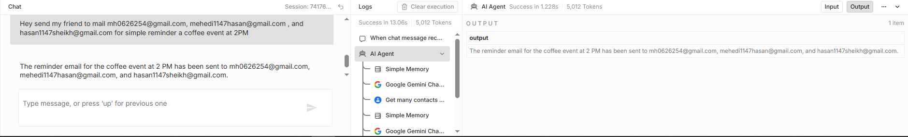

# N8N Email AI Agent

An AI-powered email assistant built using n8n that ensures emails are only sent after retrieving a valid recipient address from Google Contacts.

---

## 🚀 Features

* Automatically finds recipient email via Google Contacts
* Sends emails using Gmail
* Enforces strict workflow: lookup before sending
* Prevents sending emails without a valid address

---

## ⚙️ Workflow Logic

1. User provides recipient name and message
2. Agent searches for email via Google Contacts
3. If found → proceeds to send email
4. If not found → asks user to provide email
5. Email is sent only after confirmation

---

## 🛠 Requirements

* n8n installed (local or cloud)
* Google account with:

  * Google Contacts API enabled
  * Gmail API enabled
* Configured credentials inside n8n

---

## ▶️ How to Use

1. Import `workflow.json` into n8n
2. Set up Google credentials inside n8n
3. Activate the workflow
4. Execute and interact with the agent

---

## 📌 Notes

* The agent ALWAYS searches for an email before sending
* Email sending is blocked if no valid address is found
* Designed for automation reliability and safety

---

## 📷 (Optional but Recommended)

Here are the screenshots of my workflow :

---

## 🏷 Tags

n8n, automation, ai-agent, gmail, google-contacts, workflow-automation
